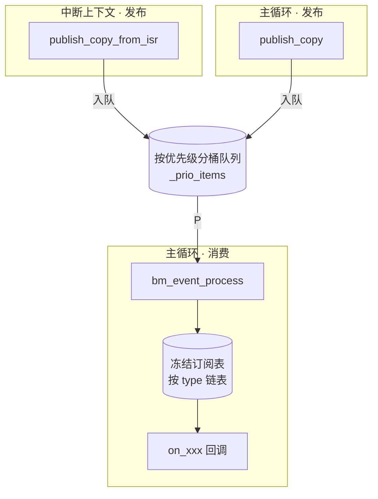

# 04 事件模块与通道

> **本文职责**：SRT 域事件、内存池、模块、通道、看门狗接线与常见错误。  
> **不负责**：混合域 HRT / snapshot → [05-混合域接线](05-混合域接线.md)。

本章说明主循环侧机制：**事件、内存池、模块、通道、看门狗**。混合域（HRT、sync、snapshot）见 [05-混合域接线](05-混合域接线.md)。

**`bm_module` vs `bm_event`**：`bm_module` 管上电 `init/start/stop`；`bm_event` 管运行期异步消息。二者常并用，职责不同。

---

## 1. 事件系统（`bm_event`）

发布/订阅 + 优先级队列。订阅回调**只在** `bm_event_process()` 中执行（含 ISR 发布路径）。

**确定性流式**：模块 `init` 完成后调用 `bm_event_freeze_subscriptions()` 冻结订阅表。
冻结后链表不可变，`bm_event_process` 直接遍历分发——无快照，WCET 可预测。
冻结亦禁止 `register_type`、`subscribe`、`unsubscribe`，保证分区器 event→owner 表不变。



### 1.1 接线：`publish` 与 `process` 分工

```text
发布方（主循环或 ISR）
    bm_event_publish_copy(type, prio, data, len)
        → 拷贝 payload 到队列槽 _event_queue[]（小数据内联存储）
        → 仅入队，不调用订阅者

主循环
    bm_event_process(max)
        → 按优先级出队，含公平性轮转防饿死
        → 遍历不可变订阅链表，调用 on_xxx(event, user_data)
        → 非可重入：回调内再次 process 返回 BM_ERR_BUSY
```

**与直接调函数的区别**：`publish` 与回调执行在时间上解耦；多订阅者、优先级由框架完成。

**冻结后确定性**：回调内可安全 `publish_copy` 级联事件，不可 `subscribe`/`unsubscribe`/`register_type`/`process`。
每事件类型订阅者数 ≤ `BM_CONFIG_MAX_EVENT_SUBSCRIBERS_PER_TYPE`（默认 4），保证分发 O(1)。

### 1.2 基本用法

```c
bm_event_register_type(EVENT_TEMP, "TEMP");
bm_event_subscribe(EVENT_TEMP, on_temp, user_ctx, &sub_id);

sensor_data_t data = { .temp = 250 };
bm_event_publish_copy(EVENT_TEMP, BM_EVENT_PRIO_NORMAL, &data, sizeof(data));

for (;;) {
    bm_event_process(8);   /* 在这里才执行 on_temp */
}
```

### 1.3 ISR 发布（仍须在主循环 `process`）

板级向量 ISR 不直接调 `bm_event_process`。典型两层结构（`interrupt_demo`）：

```text
TIMER1_IRQHandler          /* 板级驱动 interrupt_timer.c */
    → timer_callback()
        → bm_event_publish_copy_from_isr(...)   /* 入队，同 publish_copy */
主循环
    → bm_event_process()
        → 订阅者业务逻辑
```

`publish_copy_from_isr` 当前实现与 `publish_copy` 相同（临界区入队）；**禁止**在 ISR 里依赖订阅回调已执行。

适用：低频通知（按键、故障）。高频数据用 `bm_bus` LATEST 模式（[05 §7](05-混合域接线.md#7-跨域通讯)）。

### 1.4 要点

| 话题 | 说明 |
|------|------|
| 优先级 | 数值越小越高；`process` 时高优先级先出队，burst 后公平轮转 |
| 队列满 | 丢弃并递增 `bm_event_get_dropped_count()` |
| `publish_copy` | 框架拷贝 payload，发布方可立即释放源缓冲（**流式 profile 唯一允许的发布 API**） |
| `publish_event` | 零拷贝；确定性 profile（`BM_CONFIG_MP_HARD_RT_PROFILE=1`）下返回 `BM_ERR_NOT_SUPPORTED` |
| 冻结 | `bm_event_freeze_subscriptions()` 后 `register_type`/`subscribe`/`unsubscribe` 均返回 `BM_ERR_BUSY` |
| 复位 | `bm_event_reset()` 解冻并清空全部状态 |

### 1.5 常见错误

| 现象 | 可能原因 | 处理 |
|------|----------|------|
| 发布成功但回调不执行 | 主循环未调用 `bm_event_process` | 每圈调用 `process` |
| `subscribe` 返回 `BM_ERR_BUSY` | 已 `freeze_subscriptions` | 仅在 freeze 前订阅 |
| `get_dropped_count` 递增 | 队列满或发布过快 | 加大队列 / 提高 process budget / 降频 |
| ISR 里业务逻辑不跑 | 误以为 `publish_from_isr` 会同步回调 | 必须在主循环 `process` |

---

## 2. Ticker（`bm_ticker`）与事件链

`ticker` 不是独立调度器，而是 **在主循环里到期后向事件系统发信号**。
槽表在 `bm_ticker_init` 后只读；`bm_ticker_reset` 可重置（仅限停机/测试）。

```text
bm_hal_timer_init(freq)   /* 须先配置；与 HRT 共用自由运行计数器 */
bm_ticker_init(slots)     /* 校验 period_ms、event_type、priority；定时器频率为 0 则 NOT_INIT */
主循环:
    bm_ticker_poll()
        → 到期则 bm_event_publish_copy(event_type, ..., NULL, 0)
    bm_event_process()      /* 必须调用，订阅者才会运行 */
```

示例（`hrt_servo_stub`）：先 `bm_exec_start_all`（内部再 `bm_hrt_start`），再 `bm_ticker_init`；`{ 100ms, EVENT_POSITION }` → `poll` 入队 → `on_position_event` 在 `process` 中执行。队列满时 ticker 推进下一周期并累计 `bm_ticker_get_dropped()`。

---

## 3. 内存池（`bm_mempool`）

编译期静态池，无堆。

```c
BM_MEMPOOL_DEFINE(sensor_pool, sensor_data_t, 4);
sensor_data_t *obj = bm_mempool_alloc(&sensor_pool);
bm_event_publish_copy(EVENT_TEMP, 1, obj, sizeof(*obj));
bm_mempool_free(&sensor_pool, obj);   /* 安全：payload 已拷贝进队列 */
```

双释放返回错误（fail-stop）。

---

## 4. 模块生命周期（`bm_module`）

每个模块一个 `.c`，用 `BM_MODULE_DEFINE` 声明；在 `module_table.c` 用 `BM_MODULE_TABLE` 聚合（兼容 SDCC/STM8，不依赖链接器段）。

**`modules/mod_sensor.c`**

```c
static int sensor_init(void) { return BM_OK; }
static int sensor_start(void) { return BM_OK; }

BM_MODULE_DEFINE(sensor, 2, sensor_init, sensor_start, NULL, NULL);
```

**`modules/module_table.c`**

```c
BM_MODULE_DECLARE(sensor);
BM_MODULE_DECLARE(display);

BM_MODULE_TABLE(
    BM_MODULE_ENTRY(display),
    BM_MODULE_ENTRY(sensor));
```

```text
bm_module_init_all()   /* 按 priority 升序 init；失败逆序回滚 */
bm_module_start_all()  /* 按序 start */
```

| 宏 | 作用 |
|----|------|
| `BM_MODULE_DEFINE` | 单模块描述符 `_bm_mod_<name>` |
| `BM_MODULE_DECLARE` | 在表文件中前置声明 |
| `BM_MODULE_ENTRY` | 表项引用 |
| `BM_MODULE_TABLE` | 生成 `_bm_module_table` / `_bm_module_count` |

模块 `start` 里可注册事件、启动采样定时逻辑；运行期协作仍靠 `bm_event`。完整骨架见 [02-main §3](02-main骨架与数据流.md#3-nano-骨架core_sensor)。

`bm_module_init_all()` 成功后自动冻结事件订阅表。

---

## 5. 数据总线（`bm_bus`）

`bm_channel` 与 `bm_snapshot` 原语已由 `bm_bus` 统一收编（Phase 1）。

- **QUEUE 模式**（原 bm_channel 语义）：保序不丢，写满拒绝，读空返回 `BM_ERR_WOULD_BLOCK`；
- **LATEST 模式**（原 bm_snapshot 语义）：三缓冲覆盖式，读者总得到最新值，HRT/ISR 安全。

```c
/* 原 bm_channel → QUEUE */
BM_BUS_DEFINE(my_ch, sample_t, 8u, 1u, BM_BUS_QUEUE);

/* 原 bm_snapshot → LATEST */
BM_BUS_DEFINE(my_snap, pose_t, 3u, 1u, BM_BUS_LATEST);
```

详见 `include/bm/core/bm_bus.h` 及迁移示例 `tests/unit/test_bus_migration.c`。

---

## 6. 软件看门狗（`bm_wdg`）

### 6.1 推荐：主循环喂硬件狗（Nano / Lite）

单 `main`、事件协作、无分模块线程时，主循环每圈直接喂狗即可：

```c
for (;;) {
    bm_event_process(...);
    bm_wdg_feed();   /* 未注册软件模块 → 直接 bm_hal_wdg_feed() */
}
```

示例：`full_system`。`bm_module` 与看门狗无关，模块不参与注册/喂狗。

### 6.2 可选：多心跳源 AND 聚合

存在多个**独立周期入口**（ticker、`poll`、多任务）且需分别监督时，可注册软件模块：

```text
bm_wdg_register("comm");
bm_wdg_register("control");

各入口周期: bm_wdg_feed_module("comm");

主循环: bm_wdg_feed()
    → 检查每个已注册模块在 BM_CONFIG_WDG_MODULE_TIMEOUT_MS 内是否 feed_module 过
    → 全部满足才 bm_hal_wdg_feed() 硬件狗
```

任一模块超时未喂 → `bm_wdg_feed()` 不喂硬件狗。事件回调内喂狗通常不合适。

---

## 7. 临界区与日志

- `BM_CRITICAL_ENTER/EXIT`：HAL 实现，保护 SRT 共享结构。
- `BM_LOG*`：仅 SRT；**禁止** HRT ISR。

---

## 8. 相关文档

- 端到端 Nano 骨架：[02-main §3](02-main骨架与数据流.md#3-nano-骨架core_sensor)（`core_sensor`）
- 混合域接线：[05-混合域接线](05-混合域接线.md)
- Ultra 对照：[../04-测试与排障/02-版本迁移与演进](../04-测试与排障/02-版本迁移与演进.md#ultra--core)
- 运行时约束：[../04-测试与排障/03-运行时约束与排障](../04-测试与排障/03-运行时约束与排障.md)
